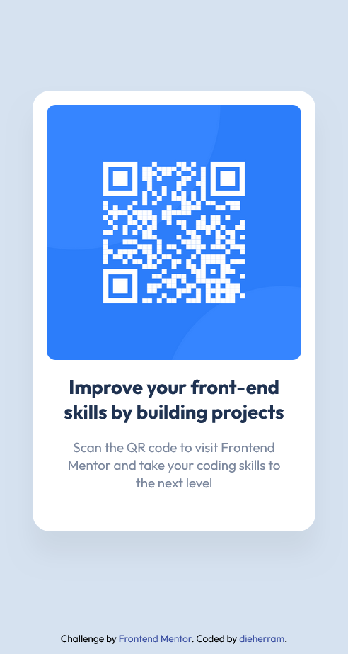

# Frontend Mentor - Solución al componente de código QR

Esta es mi solución al [desafío del componente de código QR en Frontend Mentor](https://www.frontendmentor.io/challenges/qr-code-component-iux_sIO_H).

## Descripción general

### Captura de pantalla

### Enlaces

- URL de la solución: [GitHub](https://github.com/dieherram/fem-learning-path-01-qr-code-component)
- URL del sitio en vivo: [GitHub Pages](https://dieherram.github.io/fem-learning-path-01-qr-code-component/)

## Mi proceso

### Construido con

- Marcado HTML5 semántico
- Propiedades personalizadas de CSS
- CSS Grid
- Flexbox

### Lo que aprendí

En este proyecto, reforcé mi comprensión de los siguientes conceptos:

1. **HTML semántico**: Asegurando que el HTML sea significativo y mejore la accesibilidad.
2. **CSS Flexbox**: Usando Flexbox para crear un diseño responsivo.
3. **Flujo de trabajo**: Diseñando y desarrollando para pantallas grandes y luego mejorándolo para dispositivos móviles con pantallas pequeñas.

## Desarrollo continuo

En futuros proyectos, quiero seguir mejorando mis habilidades en:

- Técnicas avanzadas de CSS como CSS Grid y animaciones.
- Mejorar las características de accesibilidad en mis proyectos.
- Construir componentes más complejos e interactivos usando JavaScript y frameworks como React.

## Autor
- [GitHub ](https://github.com/dieherram).
- [Frontend Mentor](https://www.frontendmentor.io/profile/dieherram).
